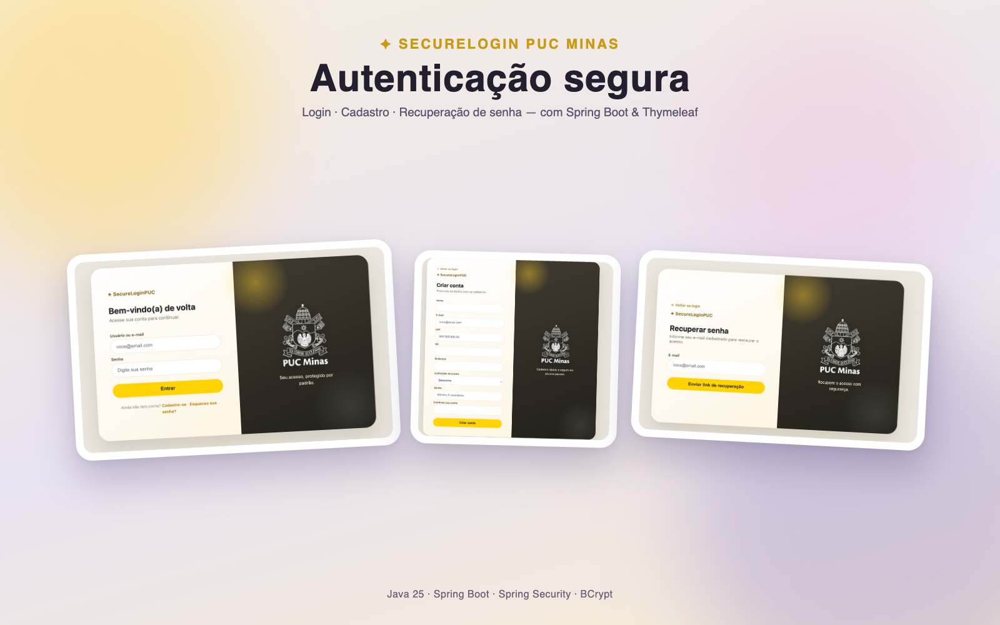
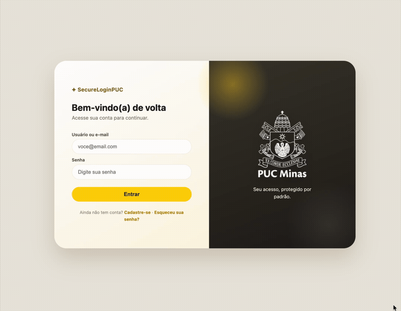
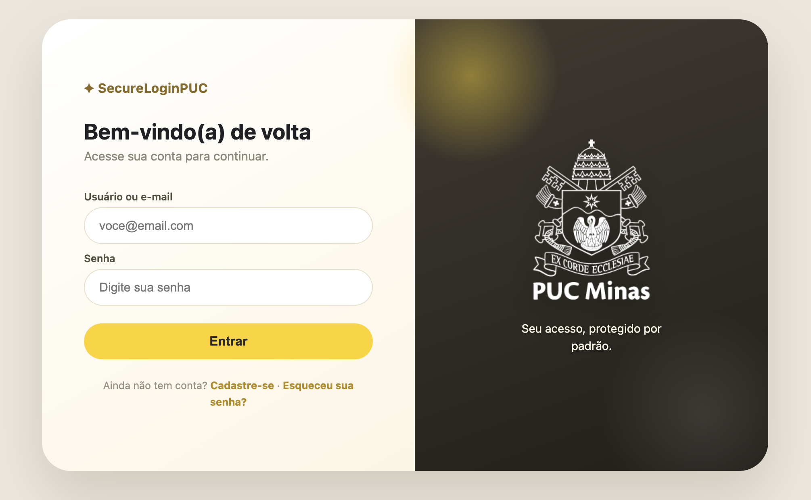
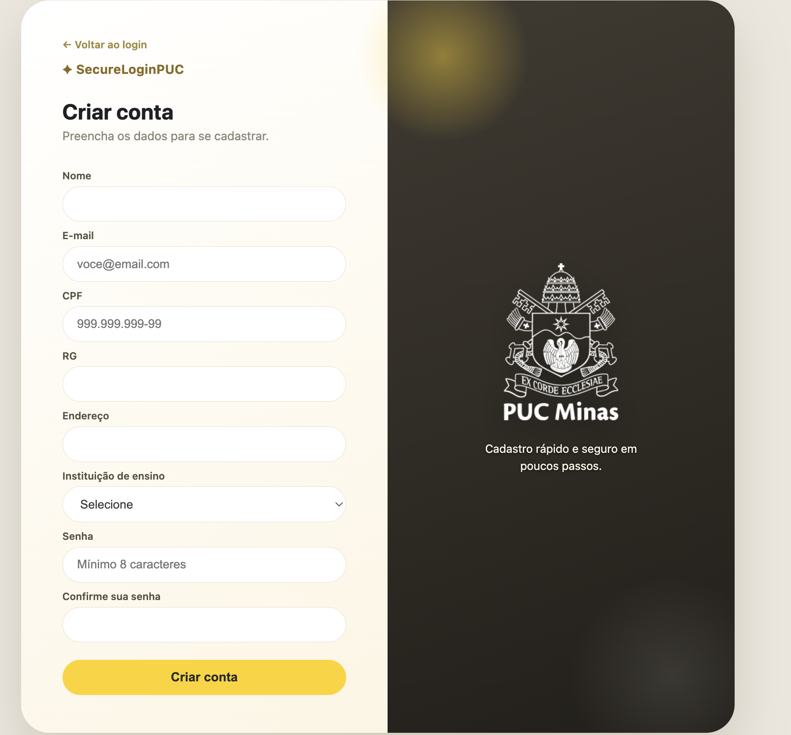
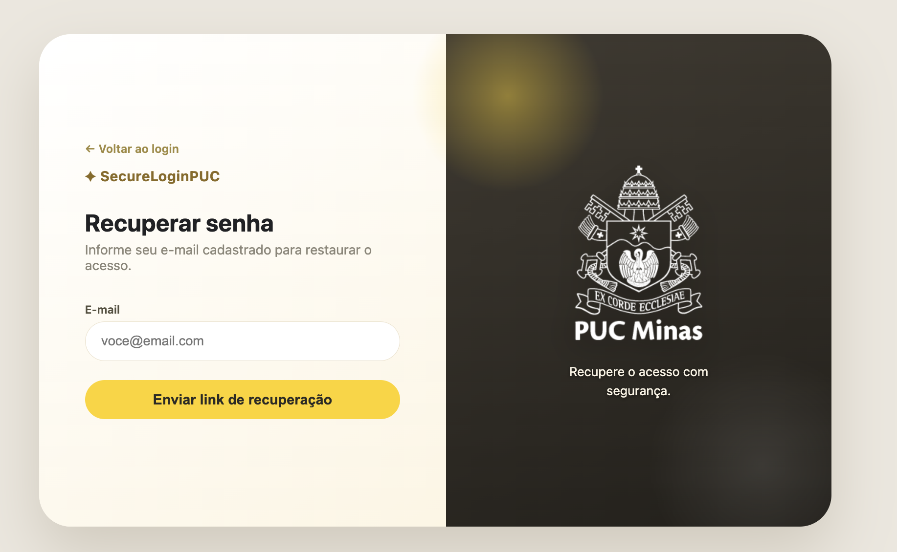

# 🔐 SecureLoginPUC

Sistema de **autenticação e cadastro de usuários** com interface web, desenvolvido com **Spring Boot**, **Thymeleaf** e **Spring Security**.



## 👥 Integrantes

- **Christiano Gonçalves Araujo**
- **Larissa Fineli**

---

## 🎯 Objetivo

Implementar uma aplicação web completa com tela de login, cadastro de novos usuários e recuperação de senha, com **senhas armazenadas de forma segura** (hash BCrypt) e **controle de acesso por perfil** (usuário comum e administrador).

## ✨ Funcionalidades

- 🔑 Login e logout (Spring Security)
- 👤 Cadastro de novos usuários
- ✅ Validações de cadastro (e-mail, senha, confirmação e duplicidade)
- 🚪 Controle de acesso por perfil (USER / ADMIN)
- 🔒 Senhas com hash BCrypt
- ✉️ Recuperação de senha (versão de estudo, com link no console)
- 🎨 Interface visual própria com Thymeleaf



---

## 🛠️ Tecnologias

- **Java 25** (LTS)
- **Spring Boot 4.1.1**
- Spring Security + Spring MVC
- **Thymeleaf**
- BCrypt (criptografia de senhas)
- Maven (com Maven Wrapper)

## 📁 Estrutura do projeto

```
src/main/
├── java/com/example/SecureLoginPUC/
│   ├── application/          # SecureLoginPUCApplication
│   ├── config/               # SecurityConfig e UserConfig
│   └── controller/           # SecureLoginController
└── resources/
    ├── static/
    │   ├── css/              # login.css (tema visual)
    │   └── images/           # logos e previews
    └── templates/            # login, register, recoverpassword, home, admin, error
```

---

## ▶️ Como executar

**Pré-requisitos**

- JDK 25 (LTS) — [Temurin 25](https://adoptium.net)
- Maven (ou use o **Maven Wrapper** do projeto, que baixa a versão certa)

**Passos**

```bash
# 1. Compilação / testes
./mvnw clean compile

# 2. Subir a aplicação
./mvnw spring-boot:run
```

Depois acesse: <http://localhost:8080/login>

---

## 🌐 Endpoints

| Método | Endpoint           | Descrição                                      | Acesso              |
| ------ | ------------------ | ---------------------------------------------- | ------------------- |
| `GET`  | `/login`           | Exibe a tela de login                          | Público             |
| `POST` | `/login`           | Processa a autenticação (Spring Security)      | Público             |
| `GET`  | `/register`        | Exibe a tela de cadastro                       | Público             |
| `POST` | `/register`        | Processa o cadastro e cria o usuário           | Público             |
| `GET`  | `/recoverpassword` | Exibe a tela de recuperação de senha           | Público             |
| `POST` | `/recoverpassword` | Processa a solicitação de recuperação          | Público             |
| `GET`  | `/home`            | Página inicial após login (usuário comum)      | Autenticado (USER)  |
| `GET`  | `/admin`           | Página de administração                        | Autenticado (ADMIN) |
| `GET`  | `/error`           | Página de erro (login inválido, etc.)           | Público             |
| `POST` | `/logout`          | Encerra a sessão                               | Autenticado         |

> Qualquer rota fora das listadas exige usuário autenticado.

---

## 🔑 Credenciais iniciais (usuários fixos)

Usuários pré-configurados no `application.properties`:

| Usuário | Senha | Perfil |
| ------- | ----- | ------ |
| `joao`  | `4321` | USER   |
| `admin` | `1234` | ADMIN  |

> 📝 Usuários criados pelo formulário de **cadastro** também conseguem logar (perfil USER padrão, senha armazenada com hash BCrypt).

## 🔒 Segurança

- Senhas **nunca** são armazenadas em texto puro — usam **BCrypt**.
- O endpoint `POST /register` valida: e-mail válido, senha mínima de 8 caracteres, senhas coincidem e e-mail não duplicado.
- Páginas de `/admin/**` são restritas ao perfil **ADMIN**.

## ➕ Recuperação de senha

A recuperação está implementada na **versão de estudo**: ao informar um e-mail cadastrado, a aplicação imprime o **link de reset no console/terminal** do servidor e exibe uma mensagem genérica na tela (sem revelar se a conta existe, por segurança).

> ⚠️ Em produção, integrar com um serviço real de e-mail (ex.: `JavaMailSender`) — e as **credenciais nunca devem ser publicadas** no repositório (usar variáveis de ambiente).

---

## 📸 Capturas de tela

Login | Cadastro | Recuperação
------|----------|-------------
 |  | 

---

## 📄 Licença

Projeto acadêmico — uso educacional.